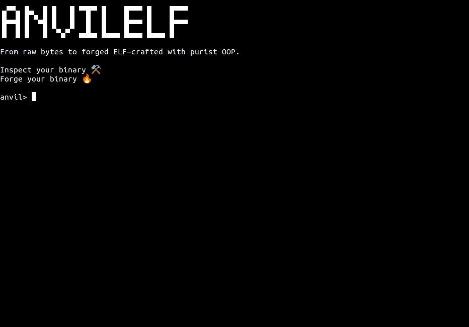

# AnvilELF ⚒️🔥


[](https://codecov.io/gh/dasuos/AnvilELF)


**From raw bytes to forged ELF—crafted with purist OOP.**

AnvilELF is a purist object-oriented tool for ELF binary parsing, inspection, and modification.  
It is built with **SOLID principles**, **full test coverage**, and a strong focus on **maintainability**.



## 🚀 Roadmap

| **Structure**                       | **Manipulation**             |
|-------------------------------------|------------------------------|
| ✅ Executable Header                 | 🔄 Process Tracing           |
| ✅ Section Headers                   | 🔄 Patching & Code Injection |
| ✅ Sections                          | 🔄 Infection Detection       |
| ✅ String & Symbol Tables            | 🔄 Obfuscation               |
| ✅ Program Headers                   |                              |
| 🔄 Segments                         |                              |
| 🔄 Relocations & Linking            |                              |
| 🧠 Obfuscated / Headerless Binaries |                              |

## 🧠 Obfuscated / Headerless Binaries
**The forge won’t cool down just because structure is missing.** 😎

AnvilELF will evolve to handle binaries that lie or hide — with lost section headers, unconventional layouts, and obfuscation.

> No e_shoff, e_shentsize, or e_shnum? Stripped section headers? Let’s dance. 🔥

## ⚡ Usage

```sh
# Show executable header
anvil> header

# List all sections
anvil> sections
anvil> sections --full

# Show a specific section by name
anvil> section --name .shstrtab
anvil> section --name .shstrtab --full

# Disassemble .text section
anvil> text
anvil> text --offset 0 --size 10
# Disassemble .plt section
anvil> plt
# Disassemble .init section
anvil> init
# Disassemble .fini section
anvil> fini

# Inspect .symtab symbol table
anvil> symtab
# Inspect .dynsym symbol table
anvil> dynsym

# Exit the shell
anvil> exit
```

## 🏗 Development

### 🐍 Installation 
```sh
git clone https://github.com/dasuos/AnvilELF.git
cd AnvilELF
make install
```

### ✅ Code quality & testing 
To verify code formatting, linting, type safety, and run all tests, use:
```sh
make check
```

### 🛠️ Auto-fixing code 
To automatically format and fix code style issues, run:
```sh
make fix
```

### 🧹 Clean up 
To remove the container and Docker image:
```sh
make clean
```

## 📝 License

This project is licensed under the [MIT License](./LICENSE).  
You are free to use, modify, and distribute it. Just don't blame the blacksmith if the anvil breaks your enemies' code. 🛠️🔥

